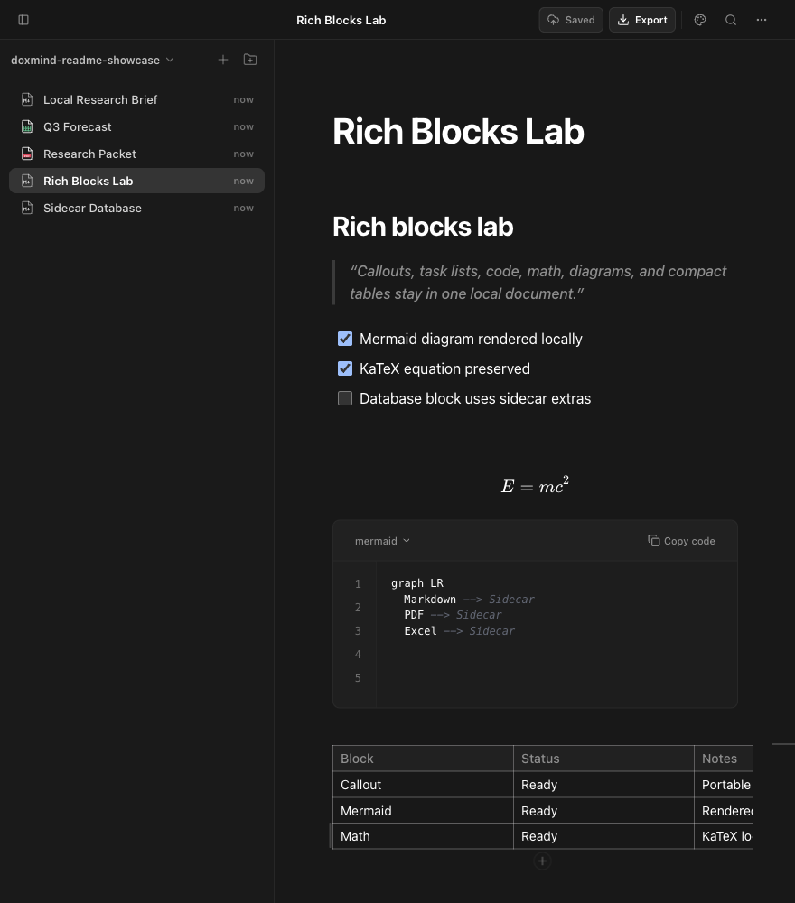
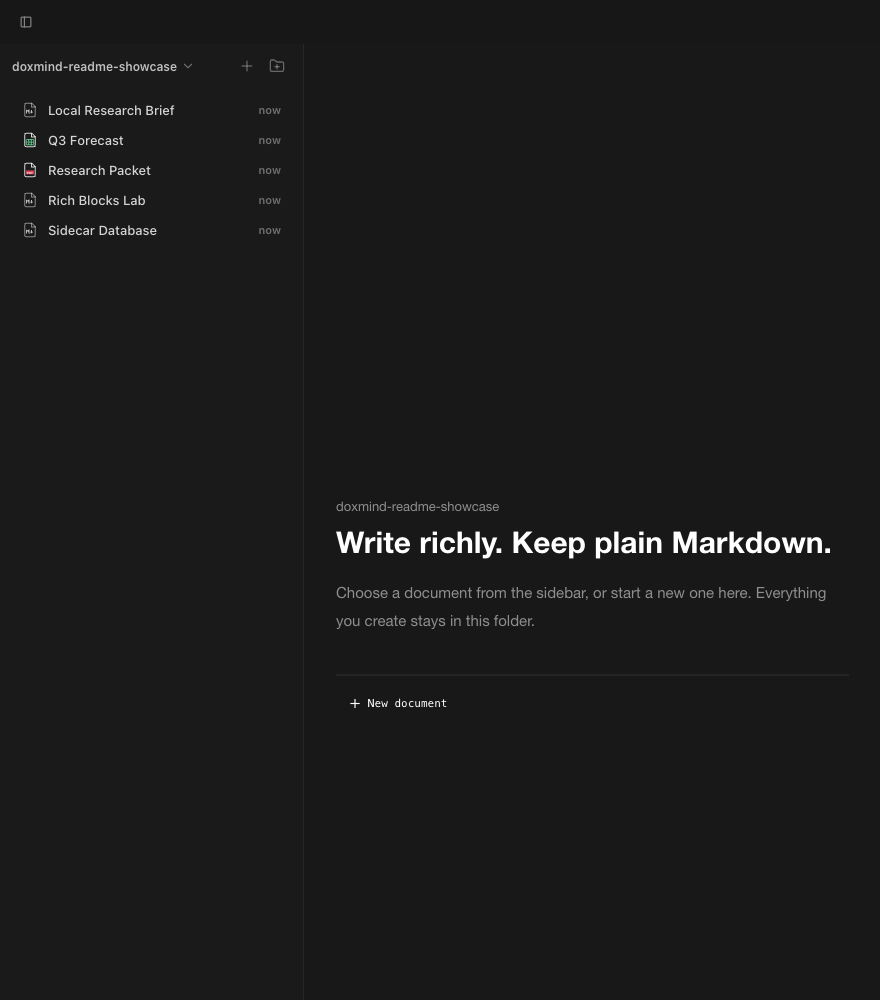

# doXmind

<p align="center">
  <a href="https://github.com/doXmind/local-desk/actions/workflows/ci.yml"></a>
  <a href="https://github.com/doXmind/local-desk/stargazers"></a>
  
  
  
  
  <a href="https://github.com/doXmind/local-desk/pulls"></a>
</p>

<p align="center">
  
</p>

<h3 align="center">A fully-local desktop IDE for Markdown, PDF, and Excel.</h3>

<p align="center">
  Open a folder. Edit your <code>.md</code>, <code>.pdf</code>, and <code>.xlsx</code> files in a rich block-based editor. doXmind keeps editor-only fidelity in hidden sidecars next to each file, so the originals stay portable in any other tool.
</p>

---

## Why doXmind

doXmind is built for people who want a polished document editor without giving up control of their files.

- **Your filesystem is the source of truth.** Every document is a normal `.md`, `.pdf`, or `.xlsx` file you can open in Finder, Git, VS Code, Obsidian, Acrobat, Excel, iCloud Drive, Dropbox, or anywhere else.
- **Rich editing stays lossless.** A hidden same-name `.doxmind` sidecar preserves editor state — TipTap HTML for Markdown, block layout for PDF, formula/format/filter state for Excel — plus doXmind-only extras like database rows.
- **External edits are respected.** When the underlying file changes outside doXmind, the file on disk wins and the sidecar is refreshed on the next save.
- **No account, no cloud, no AI runtime.** This branch has no login, no sync, no sharing links, no telemetry, no model providers, no hosted backend, and no billing.
- **Designed for desktop work.** A Tauri 2 shell wraps a Next.js editor and a localhost FastAPI sidecar that handles parsing, export, and filesystem operations.

## Three First-Class Document Types

doXmind treats Markdown, PDF, and Excel as peers. Each has its own editor surface, but they all share the same sidecar storage model.

### Markdown

A rich TipTap editor with custom blocks: headings, lists, tasks, quotes, callouts, toggles, columns, compact tables, page links, web bookmarks, code blocks (with syntax highlighting), math (KaTeX), images, Mermaid diagrams, and local database blocks. The portable `.md` file is what users see; the sidecar holds the lossless editor HTML and any block-only state.

<p align="center">
  
</p>

<p align="center">
  
</p>

### PDF

A block-based annotation and editing surface backed by PyMuPDF block extraction. Edits live in a hidden `.doxmind` sidecar next to the original PDF; the original stays untouched until you explicitly export.

<p align="center">
  
</p>

### Excel

A workbook editor with formulas, filters, autofill, cell formatting, and structural row/column operations, backed by openpyxl. Editor state lives in a hidden `.doxmind` sidecar next to the `.xlsx`.

<p align="center">
  
</p>

## Sidecar Databases

Database blocks inside Markdown documents are local data, not a hosted workspace service. Rows, schema, and view state live in `extras.databases` inside the matching `.doxmind` sidecar so the Markdown file and its rich structured data travel together.

<p align="center">
  
</p>

## Storage Model

doXmind uses a portable-file-plus-hidden-sidecar layout. The same pattern applies to all three document types:

```text
~/Documents/doXmind/
├── Project Plan.md
├── .Project Plan.doxmind          # markdown sidecar (HTML + extras)
├── Q3 Forecast.xlsx
├── .Q3 Forecast.doxmind            # excel editor state
├── Spec.pdf
├── .Spec.doxmind                   # pdf editor state
└── assets/
    └── diagram.png
```

Markdown sidecar shape:

```json
{
  "version": 1,
  "id": "dfe24100-bb43-4f93-8553-2d9fdcc50172",
  "html": "<p>...</p>",
  "markdown_hash": "sha256:abc123...",
  "updated_at": "2026-04-29T17:38:00Z",
  "extras": {
    "databases": {}
  }
}
```

`markdown_hash` is the freshness check. When the current `.md` hash matches the sidecar, doXmind reopens the richer HTML. When the hash differs, the Markdown file was edited externally, so doXmind imports the Markdown and regenerates the sidecar on save. PDF and Excel sidecars follow the same hidden-sidecar pattern; their schemas are owned by `services/pdf_blocks.py` and `services/excel_workbook.py` respectively.

A small `<sidecar>.lock` file may appear next to a sidecar during legacy-format migration. These files are tiny, persist after use, and must not be deleted manually. See [docs/adr/0003-explicit-sidecar-migration.md](docs/adr/0003-explicit-sidecar-migration.md) for the migration semantics and recovery path.

## Local Import

All import work runs on your machine. There is no remote parser service.

| Format             | Local strategy                                         | Surfaced as import |
| ------------------ | ------------------------------------------------------ | ------------------ |
| `.md`, `.markdown` | Direct read; rendered into TipTap HTML                 | Yes                |
| `.pdf`             | PyMuPDF block extraction (`services/pdf_blocks.py`)    | Yes                |
| `.xlsx`            | openpyxl workbook parse (`services/excel_workbook.py`) | Yes                |
| `.docx`            | mammoth → HTML → markdownify                           | Parser available   |
| `.pptx`            | python-pptx → per-slide markdown                       | Parser available   |

**No OCR.** Marker / Surya OCR is intentionally excluded from the runtime and from the desktop bundle — the model weights and PyTorch dependency made the bundle unshippable for a desktop IDE. Scanned-image PDFs are not currently a supported input.

<p align="center">
  
</p>

## Local Preferences

Themes, editor behavior, and per-workspace settings are stored on the device. The settings surface is intentionally focused on the local desktop edition rather than cloud accounts, billing, or provider keys.

<p align="center">
  
</p>

## Current Scope

Included:

- Local Markdown, PDF, and Excel editors
- Hidden `.doxmind` sidecars for all three document types
- Rich TipTap blocks (callouts, tasks, math, Mermaid, code, tables, databases, …)
- Local PDF block extraction and edit-export
- Local Excel workbook editing with formulas, filters, formatting, and structural ops
- Local image upload/serve for the Markdown editor
- Tauri desktop shell and localhost FastAPI sidecar

Not included (intentionally — see CLAUDE.md):

- User accounts, OAuth, teams, sharing, comments, community publishing
- Billing, quotas, telemetry
- S3, Postgres, Redis, Docker deployment, hosted cloud sync
- Chat, agents, model providers, OpenRouter, autocomplete, quick edit, document review, prompts, knowledge-base retrieval
- Marker/Surya OCR or any scanned-PDF pipeline

## Get Started

Requirements:

- Node.js 22 or newer
- Python 3.12
- Rust toolchain (only for desktop builds)

Install dependencies:

```bash
npm install
```

Run the web development app (Next.js + FastAPI):

```bash
npm run dev:all
```

Then open `http://localhost:3000`. Pick a workspace folder (the default suggested location is `~/Documents/doXmind`) and start opening or creating `.md` / `.pdf` / `.xlsx` files. There is no sign-in, API key, or provider selection.

Run the desktop shell:

```bash
npm run dev:desktop
```

Build a desktop app:

```bash
npm run build:desktop
```

## Development

Frontend commands:

```bash
npm run dev:all       # Next.js frontend + FastAPI backend, with auto-port discovery
npm run dev           # Next.js only
npm run server        # FastAPI only
npm run type-check
npm run lint
npm test              # vitest watch
npm run test:ci       # vitest run
npm run build
```

Backend commands from `server/`:

```bash
python main.py
pytest
pytest path/to/test_file.py::test_name
ruff check .
ruff format .
```

`scripts/dev.mjs` resolves Python in this order: `$DOXMIND_PYTHON`, `server/.venv/bin/python`, then `python3` / `python` on PATH.

### Environment variables

All optional:

- `DATA_DIR` — override `~/.doxmind`
- `DOXMIND_PYTHON` — Python path used by `npm run dev:all`
- `DEBUG`, `HOST`, `PORT` — backend config
- `DOXMIND_SIDECAR_MIGRATE` — controls one-shot migration of legacy PDF/Excel sidecars to the unified shape on first open. See [ADR-0003](docs/adr/0003-explicit-sidecar-migration.md).
- `DOXMIND_PERF` — opt-in performance instrumentation (writes a JSON line per span to `~/.doxmind/perf.log`); a parallel frontend flag turns on a dev overlay.
- `DOXMIND_DISABLE_DOC_CACHE` / `DOXMIND_DISABLE_PDF_CACHE` / `DOXMIND_DISABLE_XLSX_CACHE` — kill switches for the three backend process-local LRUs. Useful during benchmarking.

There are no API keys or external service credentials.

## Repository Structure

```text
src/                  Next.js app, editor UI, stores, extensions, components
  components/editor/        Markdown editor surface and toolbar
  components/pdf-editor/    PDF block editor
  components/excel-editor/  Excel workbook, sheet view, formula bar, filters
  extensions/               TipTap extensions (math, mermaid, callout, database, …)
  lib/                      Storage, markdown, pdf, and excel helpers
  stores/                   Zustand stores (file, editor, layout, settings, …)
server/               FastAPI sidecar
  api/                      Routers: workspace, images, pdf_editor, excel_editor, export, links
  services/                 pdf_blocks, excel_workbook, markdown_document_state, sidecar_io, …
src-tauri/            Tauri 2 desktop shell and native integration
crates/               Rust sidecar helpers
docs/adr/             Architecture decision records
docs/readme/          README screenshots and workflow media
```

## Architecture

```text
Tauri desktop shell
        │
        ▼
Next.js editor UI  ── localhost HTTP ── FastAPI sidecar
        │                                   │
        │                                   ▼
        └──────────── local workspace folder + .doxmind sidecars
```

The frontend owns the editing experience for all three document types. The backend sidecar owns local filesystem operations, parsing (PyMuPDF for PDF, openpyxl for Excel), export, image storage, and workspace commands. SQLite exists at `~/.doxmind/doxmind.db` only as an `app_metadata` key/value table; documents themselves never live in SQLite. Markdown files, PDFs, XLSX files, and their `.doxmind` sidecars are the durable document source.

## FAQ

<details>
<summary>Does doXmind require an account?</summary>

No. This is a single-user local desktop editor. There is no login, no API key, and no provider selection.

</details>

<details>
<summary>Where are my documents stored?</summary>

Wherever you put them. doXmind opens any folder you pick. The default suggested workspace is `~/Documents/doXmind`, but any local folder works. Rich editor state lives beside each document in a hidden `.doxmind` file with the same base name.

</details>

<details>
<summary>Can I edit files outside doXmind?</summary>

Yes. External edits are expected. For Markdown, when the file's hash no longer matches the sidecar, doXmind treats the `.md` file as newer and refreshes editor state from it. PDF and Excel sidecars follow the same precedence rule.

</details>

<details>
<summary>Does my data leave my machine?</summary>

No. The editor, workspace files, imports, exports, sidecars, and metadata are all local. There is no cloud sync, no telemetry, no hosted parsing, and no AI model runtime in this branch.

</details>

<details>
<summary>Why keep a sidecar instead of only the original file?</summary>

`.md`, `.pdf`, and `.xlsx` are portable, but they cannot represent every editor-only detail (TipTap block layout, PDF block ordering, Excel filter state, database rows) without becoming noisy or breaking compatibility with other tools. The sidecar keeps lossless state while leaving the visible file clean.

</details>

<details>
<summary>What about scanned PDFs / OCR?</summary>

Not supported. Marker / Surya OCR is intentionally excluded from the runtime and the desktop bundle — the model weights and PyTorch dependency made the bundle too large to ship as a desktop IDE. If scanned-PDF support comes back, it will be designed as an optional, lazily-installed add-on.

</details>

<details>
<summary>Is there a public release build?</summary>

This branch is currently source-first. Use `npm run dev:desktop` for development and `npm run build:desktop` to create a local desktop build.

</details>
