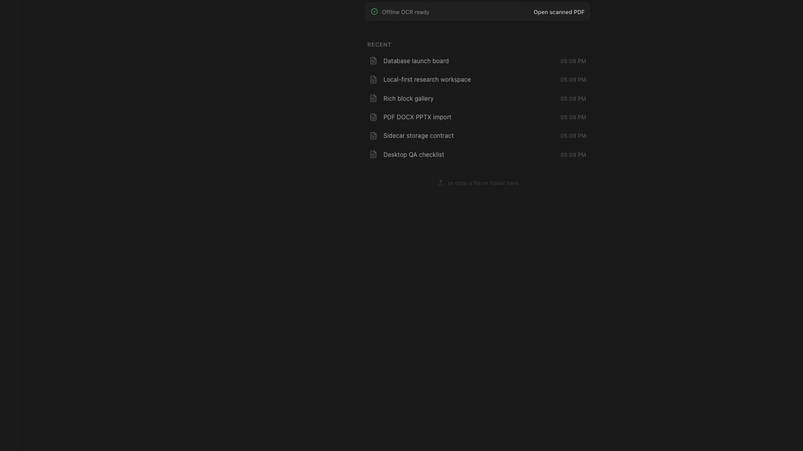
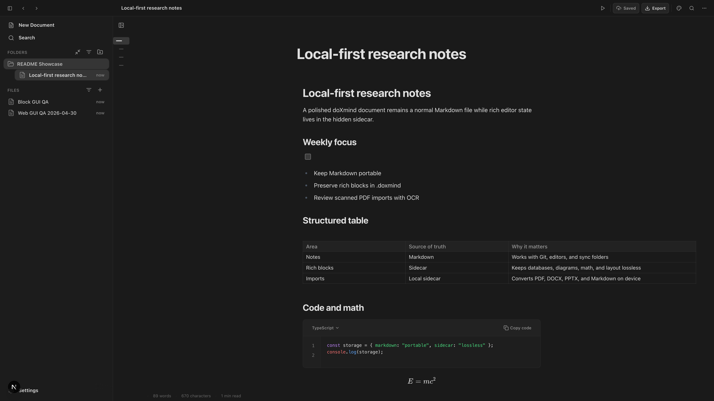
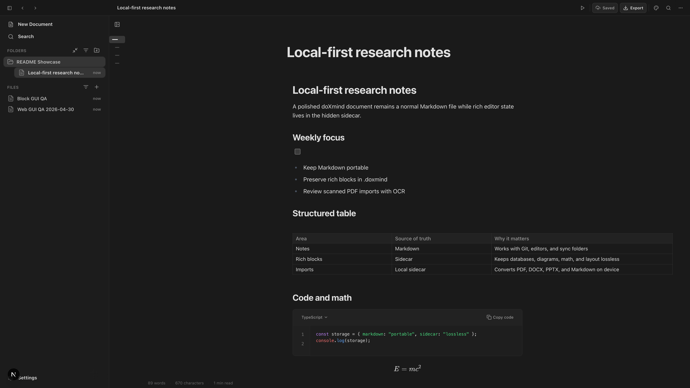

# doXmind Mini

<p align="center">
  <a href="https://github.com/doXmind/local-desk/actions/workflows/ci.yml"></a>
  <a href="https://github.com/doXmind/local-desk/stargazers"></a>
  
  
  
  
  <a href="https://github.com/doXmind/local-desk/pulls"></a>
</p>

<p align="center">
  
</p>

<h3 align="center">A local-first Markdown workspace for notes, research, and structured documents.</h3>

<p align="center">
  Write in a rich block editor while keeping portable Markdown files on disk. doXmind stores editor-only fidelity in hidden sidecars, so your notes remain readable in any Markdown tool.
</p>

---

## Why doXmind Mini

doXmind Mini is built for people who want a polished document editor without giving up control of their files.

- **Your documents are real files.** Each note is a normal `.md` file that works in Finder, Git, VS Code, Typora, Obsidian, iCloud Drive, Dropbox, and any plain Markdown workflow.
- **Rich editing stays lossless.** The hidden `.doxmind` sidecar preserves editor HTML and doXmind-only block data such as database rows, layout state, and future local metadata.
- **External edits are respected.** If the Markdown file changes outside doXmind, the file on disk wins and the sidecar is refreshed on the next save.
- **No account required.** This branch has no login, cloud sync, sharing links, billing, telemetry, model providers, or hosted backend.
- **Designed for desktop work.** A Tauri shell wraps a Next.js editor and a localhost FastAPI sidecar for local import, export, image, and filesystem operations.

## What It Feels Like

| Work in doXmind Mini     | It should give you                                                             |
| ------------------------ | ------------------------------------------------------------------------------ |
| Create a new note        | A clean Markdown file in your local workspace                                  |
| Add rich blocks          | Tables, code, math, images, diagrams, tasks, and database blocks in one editor |
| Edit the `.md` elsewhere | doXmind reloads the external Markdown and treats it as the source of truth     |
| Move a workspace folder  | The Markdown and `.doxmind` sidecars move together                             |
| Import office files      | Local Markdown output from PDF, DOCX, PPTX, or existing Markdown               |
| Work offline             | A complete editor without required cloud services or accounts                  |

## Local Markdown Workspace

doXmind Mini opens to a file tree backed by a real folder on your machine. Creating, renaming, editing, and deleting documents updates the local workspace instead of hiding everything in an application database.

<p align="center">
  
</p>

The default workspace is `~/Documents/doXmind`. You can also point the app at another local folder when running the desktop shell.

## Rich Blocks

The editor supports the document blocks that are expected in a modern knowledge workspace: headings, lists, tasks, quotes, tables, code blocks, math, images, Mermaid diagrams, embeds, and local database blocks.

<p align="center">
  
</p>

Portable Markdown remains the user-facing file. When a block needs more state than Markdown can represent cleanly, doXmind stores that state in the sidecar.

## Storage Model

doXmind Mini uses a Markdown-plus-sidecar layout:

```text
~/Documents/doXmind/
├── Research Notes.md
├── .Research Notes.doxmind
├── assets/
│   └── diagram.png
└── .doxmind/
    └── index.json
```

The Markdown file is the portable source. The sidecar is the lossless doXmind state:

```json
{
  "version": 1,
  "id": "dfe24100-bb43-4f93-8553-2d9fdcc50172",
  "html": "<h1>Research Notes</h1><p>...</p>",
  "markdown_hash": "sha256:abc123...",
  "updated_at": "2026-04-30T18:00:00Z",
  "extras": {
    "databases": {}
  }
}
```

`markdown_hash` is the freshness check. When the current `.md` hash matches the sidecar, doXmind can reopen the richer HTML. When the hash differs, the Markdown file was edited externally, so doXmind imports the Markdown and regenerates the sidecar on save.

## Document Import

All import work is local. There is no remote parser service.

| Format                        | Local strategy                                             |
| ----------------------------- | ---------------------------------------------------------- |
| `.md`, `.markdown`            | Imported as Markdown                                       |
| `.docx`                       | Converted through Mammoth and Markdownify                  |
| `.pptx`                       | Converted slide-by-slide with `python-pptx`                |
| Text-based `.pdf`             | Fast Markdown extraction through PyMuPDF4LLM               |
| Scanned or image-heavy `.pdf` | Optional Marker / Surya OCR model download, then local OCR |

Marker OCR models are not bundled. The app asks before downloading them and stores the install state locally.

## Current Scope

This repository is the local sidecar edition of doXmind Mini.

Included:

- Local Markdown workspace
- Hidden `.doxmind` sidecars
- Rich TipTap editor
- Local import and export
- Local images and attachments
- Local database blocks stored through sidecar extras
- Tauri desktop shell and localhost backend sidecar

Not included:

- User accounts, OAuth, teams, sharing, comments, community publishing, billing, quotas, telemetry, S3, Postgres, Redis, Docker deployment, hosted cloud sync, chat, agents, provider keys, OpenRouter, autocomplete, quick edit, document review, prompts, or knowledge-base retrieval.

## Get Started

Requirements:

- Node.js 22 or newer
- Python 3.12
- Rust toolchain for desktop builds

Install dependencies:

```bash
npm install
```

Run the web development app:

```bash
npm run dev:all
```

Open:

```text
http://localhost:3000
```

Run the desktop shell:

```bash
npm run dev:desktop
```

Build a desktop app:

```bash
npm run build:desktop
```

## Development

Useful commands:

```bash
npm run dev:all       # Next.js frontend + FastAPI backend
npm run dev           # Next.js only
npm run server        # FastAPI only
npm run type-check
npm run lint
npm run test:ci
npm run build
```

Backend commands from `server/`:

```bash
python main.py
pytest
ruff check .
ruff format .
```

## Repository Structure

```text
src/                 Next.js app, editor UI, stores, extensions, and components
server/              FastAPI sidecar, local import/export, filesystem APIs
src-tauri/           Tauri desktop shell and native integration
crates/              Rust sidecar helpers for Markdown and .doxmind storage
docs/readme/         README screenshots and workflow media
```

## Architecture

```text
Tauri desktop shell
        │
        ▼
Next.js editor UI  ── localhost HTTP ── FastAPI sidecar
        │                                   │
        │                                   ▼
        └──────────── local workspace folder + .doxmind sidecars
```

The frontend owns the editing experience. The backend sidecar owns local filesystem operations, conversion, image storage, export, and workspace commands. SQLite may exist as local metadata/cache, but Markdown files and `.doxmind` sidecars are the durable document source.

## FAQ

<details>
<summary>Does doXmind Mini require an account?</summary>

No. This branch is designed as a single-user local desktop editor.

</details>

<details>
<summary>Where are my documents stored?</summary>

By default, documents live in `~/Documents/doXmind` as normal Markdown files. Rich editor state lives beside them in hidden `.doxmind` files.

</details>

<details>
<summary>Can I edit files outside doXmind?</summary>

Yes. External Markdown edits are expected. When the Markdown hash no longer matches the sidecar, doXmind treats the `.md` file as newer and refreshes editor state from it.

</details>

<details>
<summary>Does my data leave my machine?</summary>

The editor, workspace files, imports, exports, sidecars, and metadata are local. This branch does not include cloud sync, telemetry, hosted parsing, or AI model calls.

</details>

<details>
<summary>Why keep a sidecar instead of only Markdown?</summary>

Markdown is portable, but it cannot represent every rich editor detail without becoming noisy. The sidecar keeps lossless state while leaving the visible file clean.

</details>

<details>
<summary>Is there a public release build?</summary>

This branch is currently source-first. Use `npm run dev:desktop` for development and `npm run build:desktop` to create a local desktop build.

</details>
