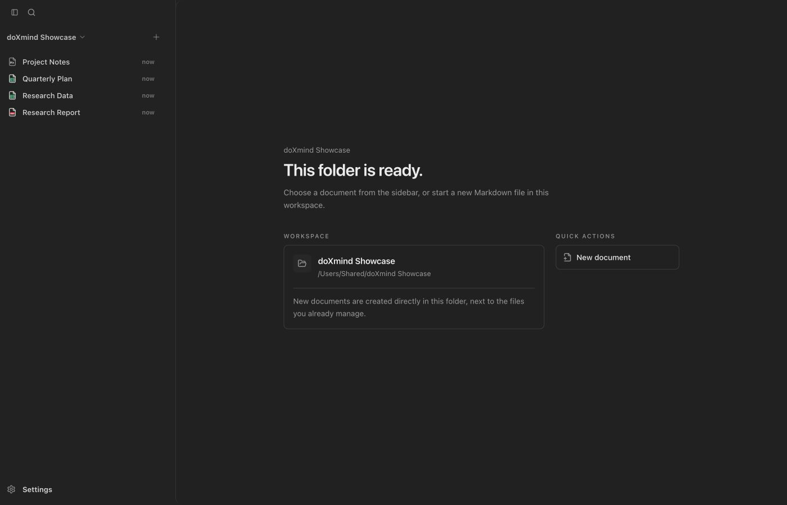
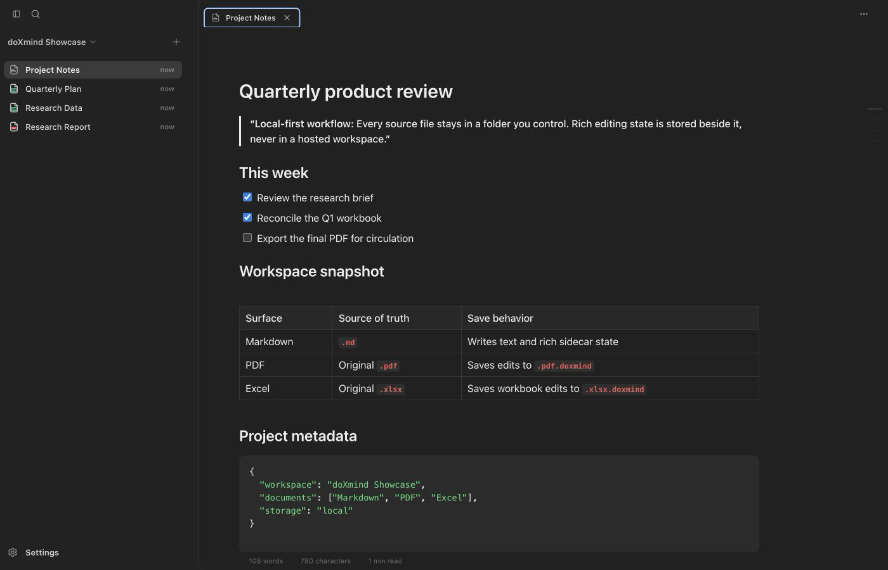
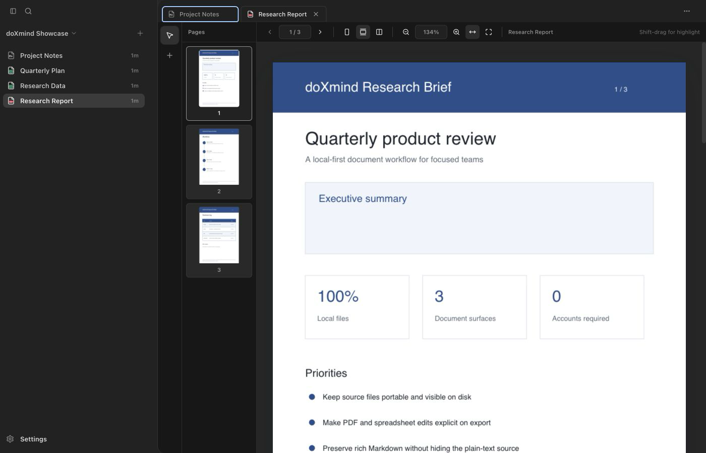
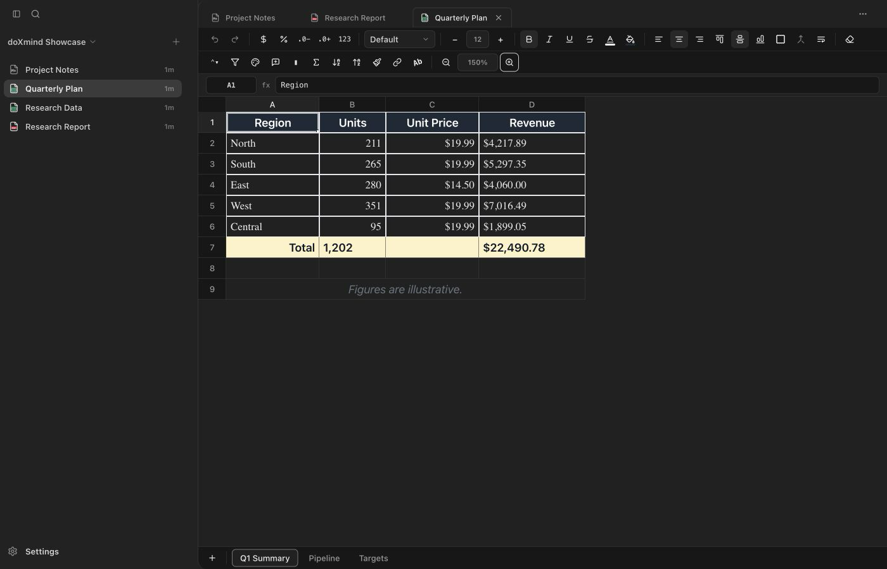
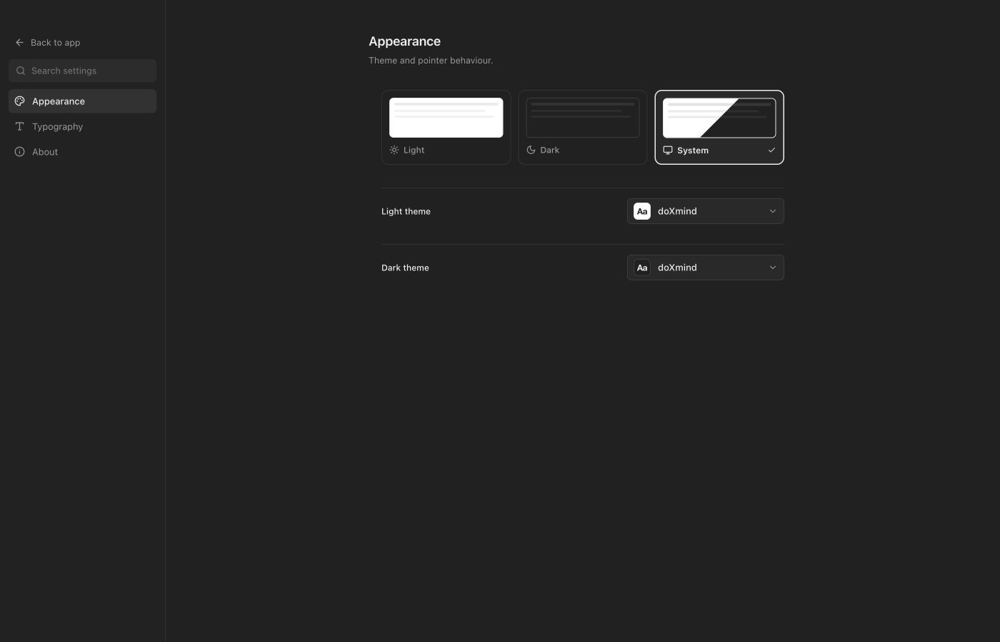

# doXmind User Guide

This guide covers the current doXmind desktop workflow for Markdown, PDF, and Excel workbooks. doXmind is local-first: your documents stay in folders you control, and editor-only state is stored beside them in hidden `.doxmind` sidecars.

For source installation and developer commands, see the [project README](../README.md).

## 1. Install and launch

The public release channel currently provides a macOS package for Apple silicon. There is no public Windows or Linux installer in the current release channel.

1. Open [doXmind Releases](https://github.com/doXmind/releases/releases/latest).
2. Download the `.dmg` file.
3. Drag doXmind to Applications, then open it.

Document content, parsing, exports, and sidecars stay local. doXmind also stores application metadata under `~/.doxmind`. It does not require an account, API key, cloud workspace, or hosted parser; update checks and user-requested web bookmark previews can use the internet.

## 2. Choose how to work

doXmind supports two opening modes. Pick the one that matches the task.

### Open a folder

Use **File → Open Folder…** (`Cmd/Ctrl+Shift+O`) when several related documents belong together.

- The folder becomes the workspace root.
- The sidebar shows supported documents and subfolders under that root.
- New documents are written directly into that folder.
- Files opened inside the workspace use tabs in the same window.

  

### Open one file

Use **File → Open File…** (`Cmd/Ctrl+O`), double-click a registered document, or choose **Open With → doXmind** when you want one standalone file.

- doXmind opens that file without scanning or displaying its siblings.
- Its parent folder is used only for source-file and sidecar access.
- Closing the standalone document returns to the welcome screen.

### Start a new document

Choose **Start writing** on the welcome screen to create an untitled Markdown buffer. The document stays in memory until its first save, when doXmind asks where to put it.

When a folder is already open, **File → New Document** (`Cmd/Ctrl+N`) creates a real Markdown file inside that workspace instead.

### Recent items and drag-and-drop

- The welcome screen lists recent standalone files and workspace folders.
- Drag a folder onto the welcome screen to mount it as a workspace.
- Drag a stable document (`.md`, `.markdown`, `.pdf`, `.xlsx`, or `.xlsm`) onto the welcome screen to open it.
- Drag an external `.md`, `.pdf`, or `.xlsx` file into an open workspace to copy it there; the original stays where it was.
- If a copied file has the same name as an existing workspace file, choose whether to replace it, keep both, or skip it.

## 3. Manage a workspace

The sidebar is a direct view of the selected folder.

### Create items

Use the **+** menu in the workspace header, or right-click a folder/empty area, to create:

- A blank Markdown document
- A blank PDF
- A blank Excel workbook
- A folder
- A Markdown document from a built-in template such as Meeting Notes, Blog Post, Study Notes, or Journal

### Work with files

- Click a document to open it in a tab.
- Use `Cmd/Ctrl+Tab` for the quick file switcher.
- Drag files and folders within the sidebar to move them inside the workspace.
- Rename from the sidebar context menu; doXmind preserves the original document extension.
- Use **File → Reveal in Finder** (`Cmd/Ctrl+Alt+R`) to locate the active source file.
- Use `Cmd/Ctrl+B` to show or hide the sidebar.
- Use `F11` for focus mode; press `Esc` or `F11` again to leave it.

### Delete and recover

Deleting a document sends both the source file and its sidecar to the operating system Trash/Recycle Bin. They appear as separate entries.

To recover the complete document state:

1. Open the system Trash/Recycle Bin.
2. Restore the source file.
3. Restore its hidden `.doxmind` companion to the same original folder.

On macOS, press `Cmd+Shift+.` in Finder or Trash if hidden files are not visible. Restoring only a PDF/XLSX source loses edits stored in its sidecar; restoring only Markdown text can lose rich editor-only state. doXmind does not maintain a separate in-app Trash.

## 4. Edit Markdown

Markdown files open in a rich reading surface. Click the document body or start typing to enter editing mode.

  

### Add content

Type `/` on an empty line to open the block menu. Available blocks include:

- Paragraphs and headings 1–6
- Bulleted, numbered, and task lists
- Quotes, callouts, dividers, and toggles
- Tables and two-to-five-column layouts
- Images, web bookmarks, page links, and page mentions
- Code blocks with syntax highlighting
- KaTeX math and Mermaid diagrams
- A table of contents

Database blocks can still render in older documents, but the insertion entry is currently hidden while that feature remains in internal beta.

### Navigate and inspect

- `Cmd/Ctrl+F` searches inside the active document.
- The outline rail appears when a document has multiple headings; select a heading to jump to it.
- The status bar reports words, characters, and estimated reading time.
- `Cmd/Ctrl+K` opens the command palette.
- `Cmd/Ctrl+Shift+?` opens the shortcut reference.

### Save and export

Autosave is enabled by default and writes after a short pause. `Cmd/Ctrl+S` saves immediately.

Saving Markdown writes two files:

1. The portable `.md` text.
2. A hidden `.doxmind` sidecar containing lossless editor HTML and doXmind-only extras.

Open **More actions (⋯)** in the document's top bar, then choose an Export format:

- **Markdown** — creates a portable `.md` copy.
- **PDF** — renders the current Markdown through the local PDF exporter.

Depending on the format and desktop shell, the system either asks for a destination or puts the exported file in the configured Downloads folder.

Word export is not available in the current desktop edition.

### External Markdown edits

You can edit the same `.md` file in another application. When the Markdown hash no longer matches the sidecar, doXmind treats the `.md` file as newer, imports it, and regenerates rich editor state on the next save.

Avoid editing the same document simultaneously in doXmind and another writer: the last save can overwrite the other process's changes.

## 5. Read and edit PDFs

Open a PDF from the sidebar or as a standalone file.

  

### Read and navigate

- Use the thumbnail panel to jump between pages.
- Switch between single-page, continuous, and two-page views.
- Zoom manually or use fit-width/fit-page controls.
- Use the page field and previous/next controls for direct navigation.

### Edit and annotate

- Choose **Select & edit**, then select an extracted text block to change its text or formatting.
- Choose **Add text**, then click a page to place a free-text box.
- Hold `Shift` and drag on a page to create a highlight region.
- Selected text or objects expose controls for font, size, alignment, color, highlight, and opacity where applicable.
- Use Delete/Backspace to remove the selected editable object; use undo to recover recent changes.

Text editing depends on text that can be extracted from the PDF. Scanned/image-only pages do not become editable because doXmind does not include OCR.

### Save versus Export

- **Save** stores text edits, free text, and highlights in the hidden `.pdf.doxmind` sidecar.
- **Export PDF** from **More actions (⋯)** creates a new PDF with the current edits applied. Choose a destination if prompted; otherwise check the configured Downloads folder.
- The original PDF is not silently rewritten by open, edit, save, sidecar migration, or cache refresh.

## 6. Edit Excel workbooks

Open an `.xlsx` workbook from a workspace or as a standalone file.

  

### Cells and formulas

- Select a cell to inspect or edit its value in the grid or formula bar.
- Press `F2` to edit the active cell.
- Enter formulas with `=`; the local formula engine recalculates many Excel-style formulas, but it is not a complete Excel compatibility layer. Review error cells and formula results after opening or exporting a complex workbook.
- Copy, cut, paste, undo, redo, and use the fill handle for repeated values or formulas.
- Use `Cmd/Ctrl+F` for workbook find/replace.

### Format and organize

The workbook toolbar supports:

- Number, currency, percent, and decimal formatting
- Font emphasis, text/fill colors, borders, alignment, rotation, and overflow
- Merge cells, comments, links, and format painter
- Sorting, filters, conditional formatting, and data-validation lists
- Freeze controls and adjustable row heights/column widths
- Inserting and deleting rows or columns
- Adding, renaming, duplicating, deleting, and switching worksheets

Structural row/column operations do not automatically rewrite existing formula references. Review formulas after inserting or deleting rows or columns.

### Save versus Export

- **Save** stores the workbook edit model in the hidden `.xlsx.doxmind` sidecar.
- **Export XLSX** from **More actions (⋯)** applies the current edits to a new workbook file. Choose a destination if prompted; otherwise check the configured Downloads folder.
- The original workbook is not silently overwritten.

Macro-enabled `.xlsm` files can open through the workbook path, but VBA preservation is not guaranteed on export. Keep a backup and do not use doXmind as the only editor for a macro-critical workbook.

## 7. Settings

Open **doXmind → Settings…** (`Cmd/Ctrl+,`) or select **Settings** at the bottom of the sidebar.

  

The current settings surface contains:

- **Appearance** — Light, Dark, or System mode and the preferred light/dark theme.
- **Typography** — editor font and reading rhythm preferences.
- **About** — app version, build/channel information, privacy notes, acknowledgements, and project information.

Settings are stored locally on the device.

## 8. Understand source files and sidecars

The companion filename depends on the document type:

| Source document       | Sidecar                        |
| --------------------- | ------------------------------ |
| `Project Plan.md`     | `.Project Plan.doxmind`        |
| `Research Report.pdf` | `.Research Report.pdf.doxmind` |
| `Quarterly Plan.xlsx` | `.Quarterly Plan.xlsx.doxmind` |

Keep the source and sidecar together when moving, backing up, or restoring a document. Save on PDF/XLSX changes the sidecar, not the original binary; Export creates the portable edited copy.

### What each file means

- **Markdown:** the `.md` text is the portable source. The sidecar preserves richer editor HTML and extras.
- **PDF:** the original binary is the source. The sidecar stores your text edits, free text, and highlights.
- **Excel:** the original workbook is the source. The sidecar stores your workbook edits.

Do not manually delete a sidecar if you want to keep PDF annotations, spreadsheet edits, or rich Markdown-only state.

### Advanced: legacy migration files

When doXmind migrates an older PDF/Excel sidecar:

- `<sidecar>.bak` is the backup of the original sidecar.
- `<sidecar>.lock` coordinates the migration and can remain afterward.
- `<sidecar>.corrupt-*` is a recovery copy created when corrupt data cannot be migrated safely.

Do not delete `.lock` or `.bak` files merely because they are small or hidden. If a migration error asks for recovery, move/rename the `.bak` file back over the sidecar only after closing doXmind and confirming the target document.

## 9. Keyboard shortcuts

The current public desktop release is for macOS, where shortcuts use `Cmd`. Browser development and compatibility builds on other platforms use `Ctrl` unless shown otherwise.

| Action                                   | Shortcut           |
| ---------------------------------------- | ------------------ |
| New document in an open workspace        | `Cmd/Ctrl+N`       |
| New window                               | `Cmd/Ctrl+Shift+N` |
| Open file                                | `Cmd/Ctrl+O`       |
| Open folder                              | `Cmd/Ctrl+Shift+O` |
| Save                                     | `Cmd/Ctrl+S`       |
| Find in document/workbook                | `Cmd/Ctrl+F`       |
| Command palette                          | `Cmd/Ctrl+K`       |
| Quick switcher                           | `Cmd/Ctrl+Tab`     |
| Quick switcher from the native Edit menu | `Cmd/Ctrl+P`       |
| Toggle sidebar                           | `Cmd/Ctrl+B`       |
| Focus mode                               | `F11`              |
| Exit focus mode                          | `Esc`              |
| Shortcut reference                       | `Cmd/Ctrl+Shift+?` |
| Reveal active source file                | `Cmd/Ctrl+Alt+R`   |

Standard editing shortcuts for undo, redo, cut, copy, paste, and select all also work in the active editor.

## 10. Limits and troubleshooting

### A file does not appear in a workspace

- Confirm it is a stable document type: Markdown, PDF, or XLSX/XLSM.
- Refresh or reopen the folder after changing files outside doXmind.
- DOCX and PPTX are not supported workspace documents.

CSV support is still under development and is not part of the stable list. Although current development builds expose CSV entry points, opening a CSV from a mounted folder is not yet reliable; convert it to `.xlsx` first.

### A scanned PDF has no editable text

doXmind does not include OCR. It can display image-only pages, but text editing requires extractable PDF text.

### A PDF or workbook is very large

The local import/parse request limit is 10 MiB. Workbook parsing is also capped at 64 worksheets, 5,000 rows per sheet, and 200 columns per sheet. Split very large inputs before opening them when possible.

### A document is read-only after an upgrade

Legacy PDF/Excel sidecars are read-only when migration is disabled. Remove the override or set `DOXMIND_SIDECAR_MIGRATE=1`, then reopen the document. If a `.bak` conflict or corrupt-sidecar message appears, follow the exact recovery path shown by the app instead of deleting files.

### Changes are missing from an exported workbook

- Save before exporting and wait for the header to show **Saved**.
- Export to a new `.xlsx` file and open that file, not the original source workbook.
- Recheck formulas after structural row/column changes.
- Do not assume VBA macros survive an `.xlsm` export.

### Changes are missing from an exported PDF

- Save and wait for the header to show **Saved**.
- Use the PDF-specific Export action.
- Open the newly exported copy; the original PDF is intentionally unchanged.

## 11. Privacy and optional automation

The desktop editor keeps document content, parsing, exports, sidecars, and application metadata on the machine. doXmind has no built-in cloud account, telemetry, or AI runtime. Packaged builds can check the release service for updates, and inserting a web bookmark can request that page and its preview image.

Advanced users can separately install the local `doxmind` CLI or `doxmind-mcp` server. Those tools operate directly on a selected local workspace and do not require the desktop app to be running. See [CLI & MCP](cli-and-mcp.md). Avoid editing the same document concurrently in the app and another process.
