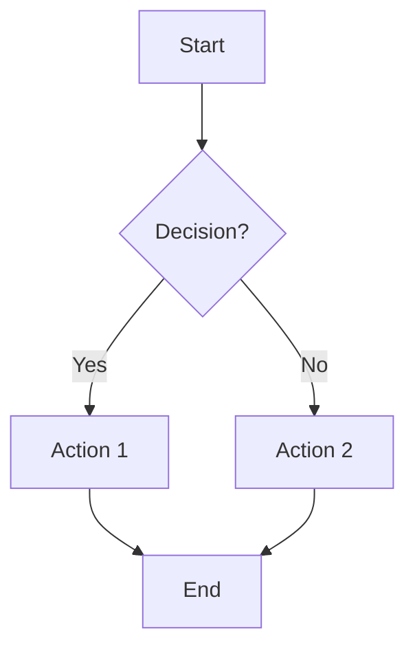
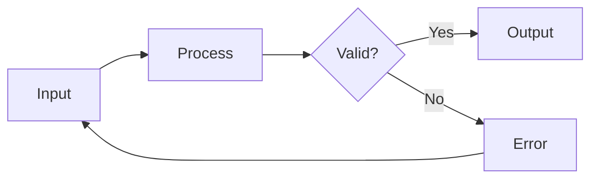
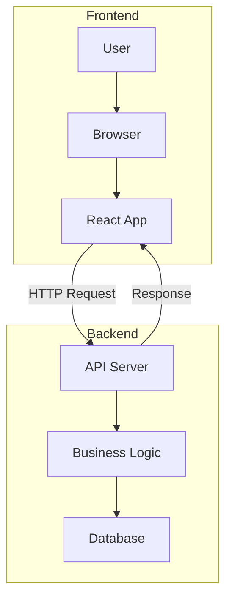
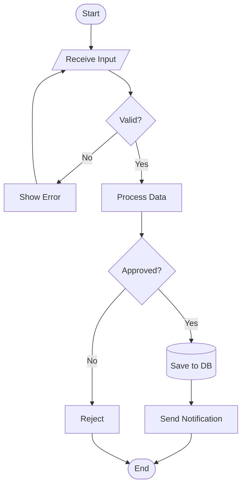
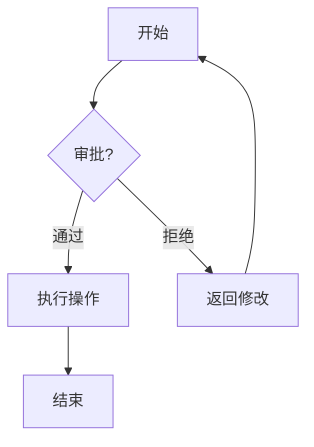
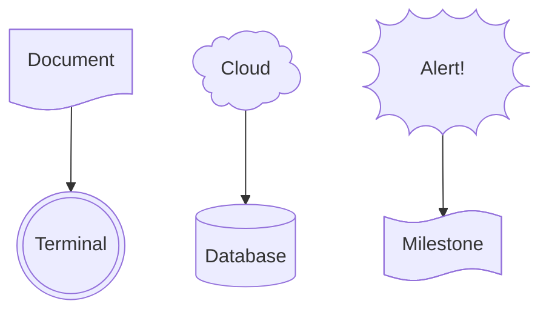
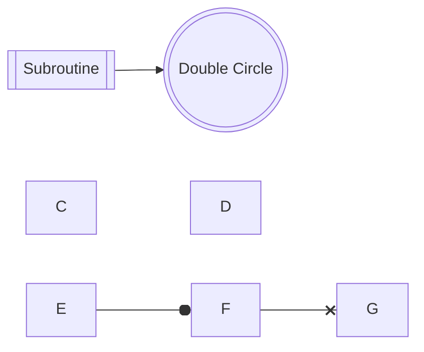

# Flowchart Templates

## Basic Top-Down Flowchart

## Left-Right Flowchart

## Flowchart with Subgraphs

## Multi-Decision Flowchart

## Non-ASCII Labels (Chinese/Japanese/Korean)

**Note:** Use ASCII IDs (A, B, C) with non-ASCII text in labels: `A[中文标签]`. Prefer ASCII IDs for reliability.

## Expanded Shapes (v11.3.0+)

Use the `@{ shape: name }` syntax for 30+ specialized shapes:

Common shapes: `doc`, `cloud`, `bang`, `flag`, `dbl-circ`, `cyl`, `stadium`, `diam`, `hex`, `rect`, `fr-rect` (subroutine), `hourglass`, `bolt`, `braces`, `tag-rect`, `sm-circ`, `cross-circ`, `card`, `delay`, `multi-doc`, `stored-data`, `text-block`

## Additional Link Types

- `A ~~~ B` - Invisible link (for layout control, no visible line)
- `A --o B` - Link with circle end
- `A --x B` - Link with cross end
- `A <--> B` - Bidirectional arrow

## Node Shapes Reference

- `[Text]` - Rectangle (process)
- `{Text}` - Diamond (decision)
- `([Text])` - Stadium/pill (start/end)
- `[(Text)]` - Cylinder (database)
- `[/Text/]` - Parallelogram (input/output)
- `((Text))` - Circle
- `>Text]` - Flag
- `{{Text}}` - Hexagon
- `[[Text]]` - Subroutine/subprocess
- `(((Text)))` - Double circle
