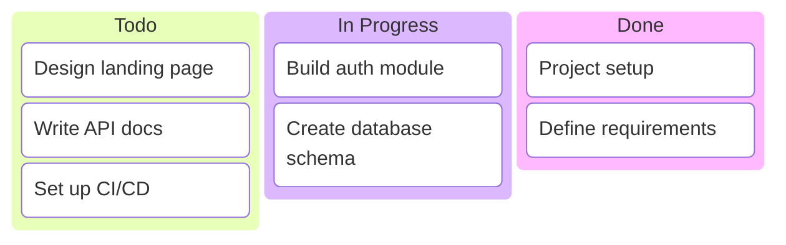
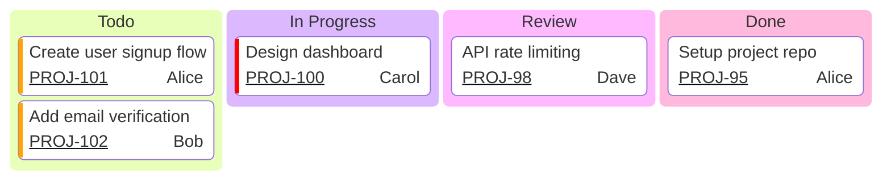
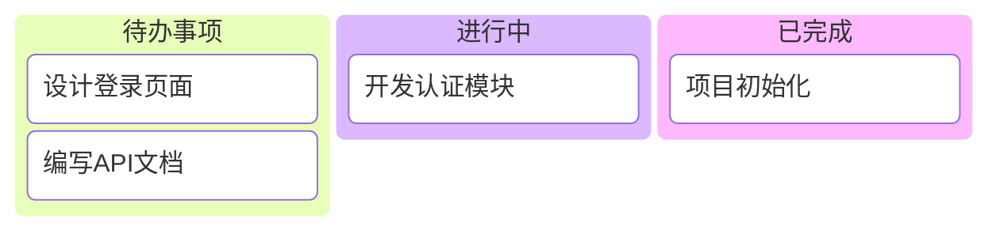

# Kanban Board Templates

## Basic Kanban

## Kanban with Metadata

## Non-ASCII Labels (Chinese/Japanese/Korean)

**Note:** Column/task IDs must be ASCII (todo, t1, t2). Put non-ASCII text in bracket labels: `todo[待办事项]`, NOT `待办[待办事项]`.

## Key Syntax

- `kanban` - Declaration keyword
- **Columns**: `columnId[Column Title]` - IDs must be ASCII, labels support non-ASCII
- **Tasks**: `taskId[Task Description]` - nested under columns via indentation
- **Metadata**: `@{ assigned: Name, ticket: ID, priority: Level }`
- **Priority levels**: `Very High`, `High`, `Low`, `Very Low`
- **Config**: `ticketBaseUrl` with `#TICKET#` placeholder for clickable links
