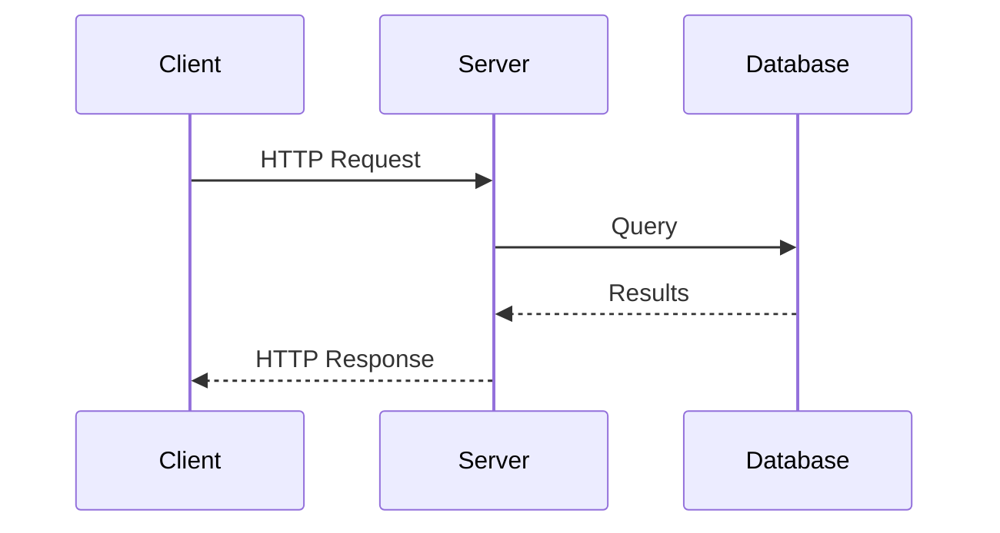
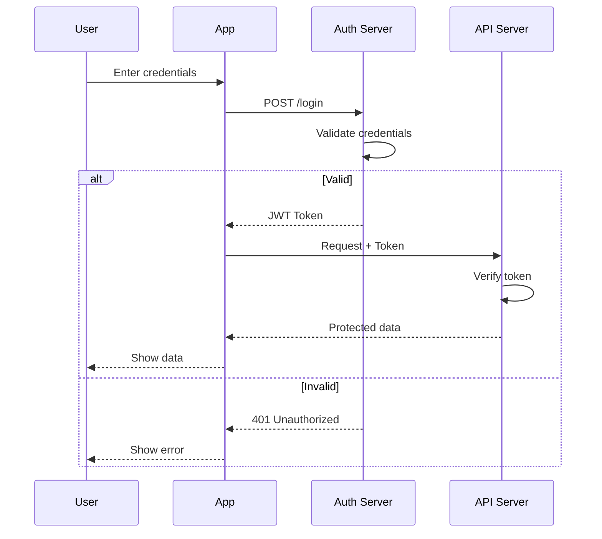
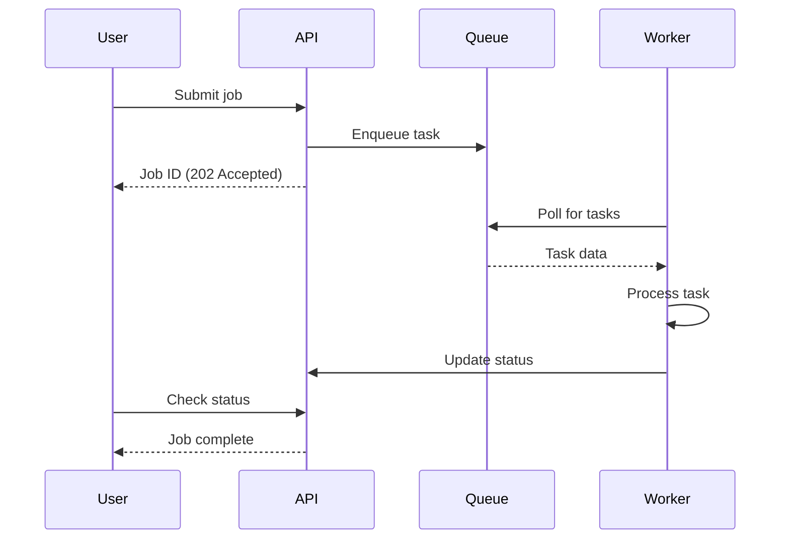
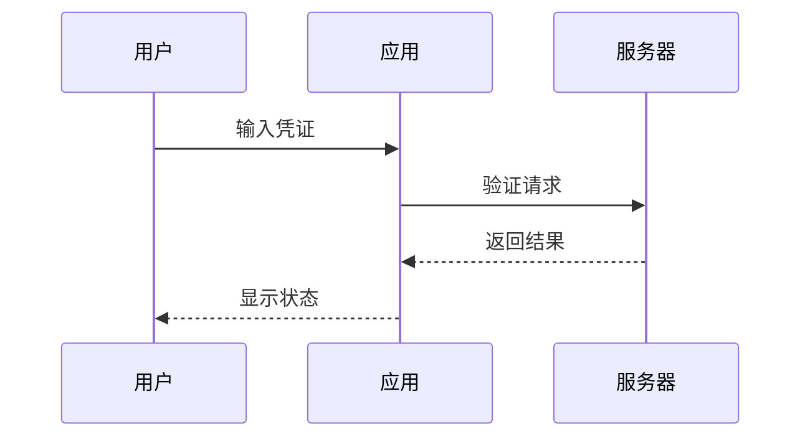
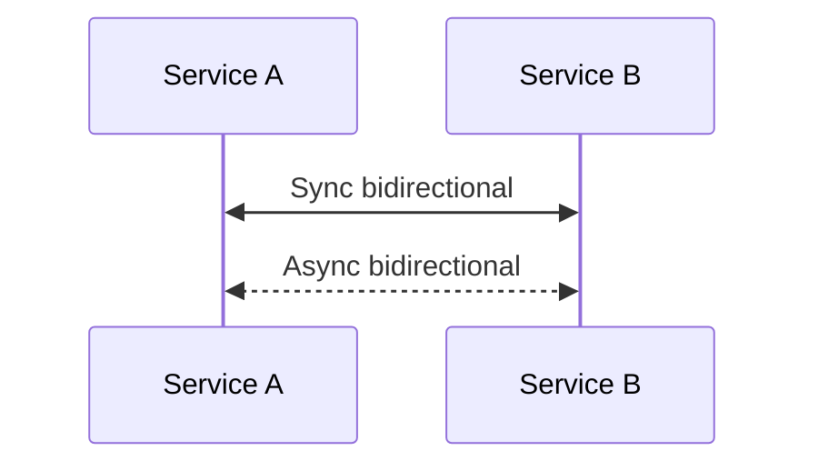
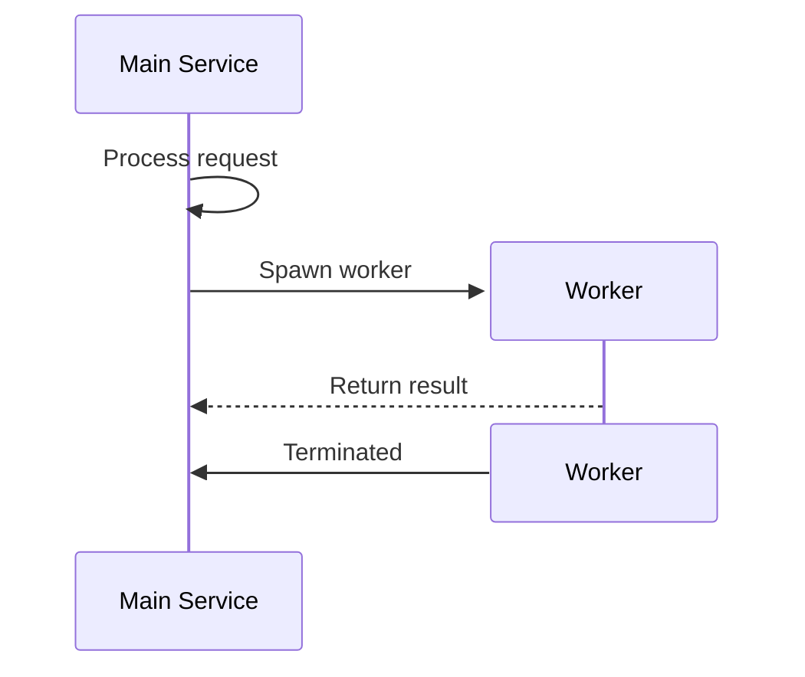
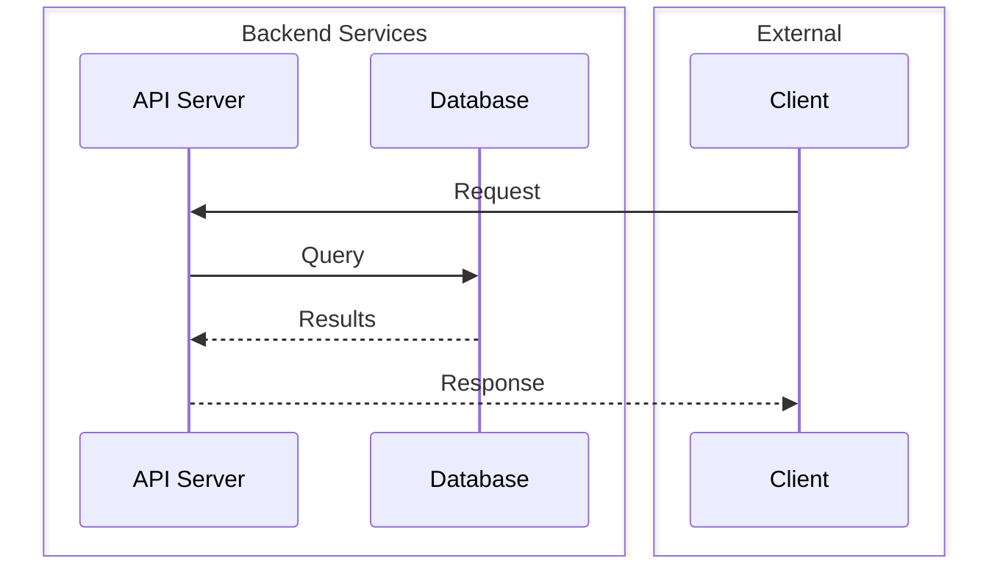

# Sequence Diagram Templates

## Basic Request-Response

## Authentication Flow

## Async Processing

## Non-ASCII Labels (Chinese/Japanese/Korean)

**Note:** Participant aliases (U, A, S) must be ASCII. Use `as` for non-ASCII display names: `participant U as 用户`. Message text after `:` supports non-ASCII.

## Bidirectional Arrows (v11.0.0+)

## Actor Creation and Destruction

## Participant Grouping (Boxing)

## Key Syntax

- `->>` Solid line with arrowhead (synchronous)
- `-->>` Dashed line with arrowhead (response/async)
- `--)` Solid line with open arrow
- `<<->>` Bidirectional solid arrow (v11.0.0+)
- `<<-->>` Bidirectional dashed arrow (v11.0.0+)
- `alt/else/end` - Conditional paths
- `loop/end` - Repeated interactions
- `par/and/end` - Parallel execution
- `critical/option/end` - Critical sections with fallbacks
- `rect rgb(r,g,b)/end` - Background highlighting
- `Note over A,B: text` - Notes spanning participants
- `activate/deactivate` - Activation bars
- `autonumber` - Auto-number all messages
- `create participant B` / `destroy B` - Dynamic actor lifecycle
- `box Color Description ... end` - Group participants
- **Non-ASCII:** Use `participant ID as 中文名` for non-ASCII display names
