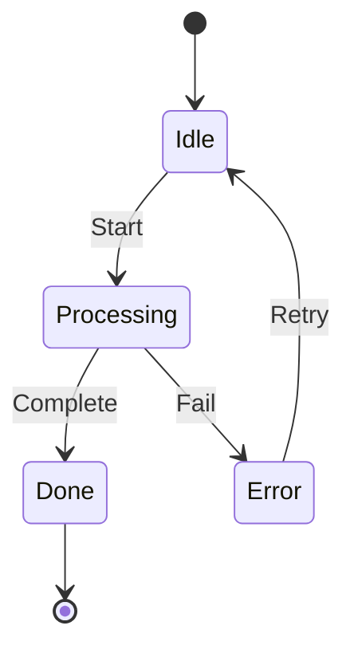
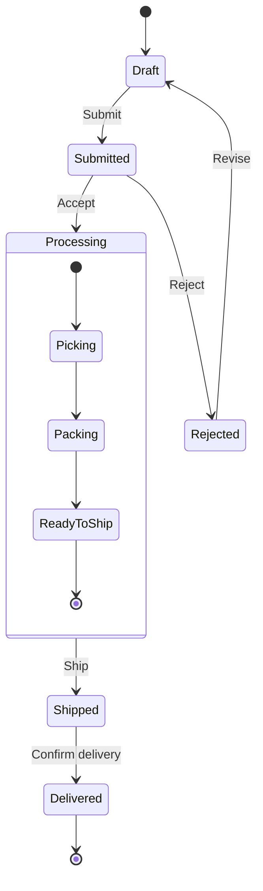
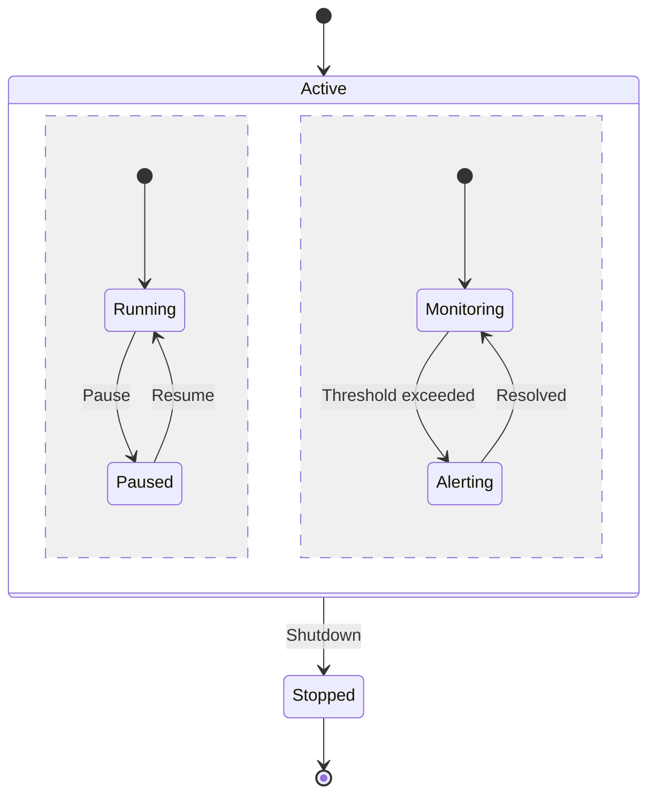
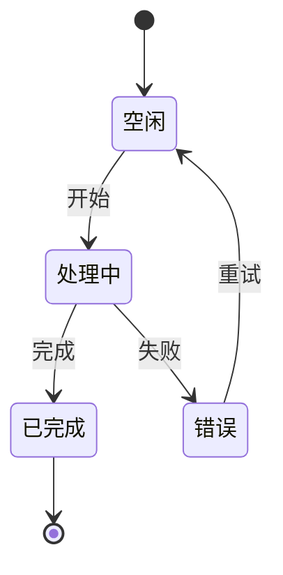
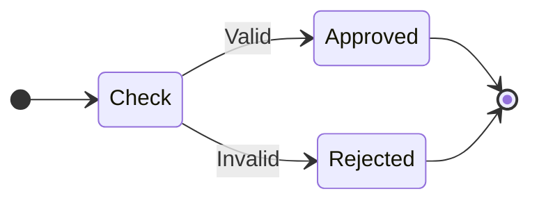

# State Diagram Templates

## Basic State Machine

## Order Lifecycle

## Concurrent States

## Non-ASCII Labels (Chinese/Japanese/Korean)

**Note:** State names in references must be ASCII. Use `state "中文" as id` alias syntax for non-ASCII display. Transition labels after `:` support non-ASCII.

## Direction and Choice States

## Key Syntax

- `[*]` Start or end state
- `-->` Transition with optional label after `:`
- `direction LR` - Set layout direction (LR, RL, TB, BT)
- `state Name { }` Composite state
- `state "Display Name" as id` Alias for non-ASCII display names
- `state name <<choice>>` Decision/choice point
- `state name <<fork>>` / `<<join>>` Fork and join states
- `--` Separator for concurrent regions
- `note right of State` / `note left of State` Multi-line notes (end with `end note`)
