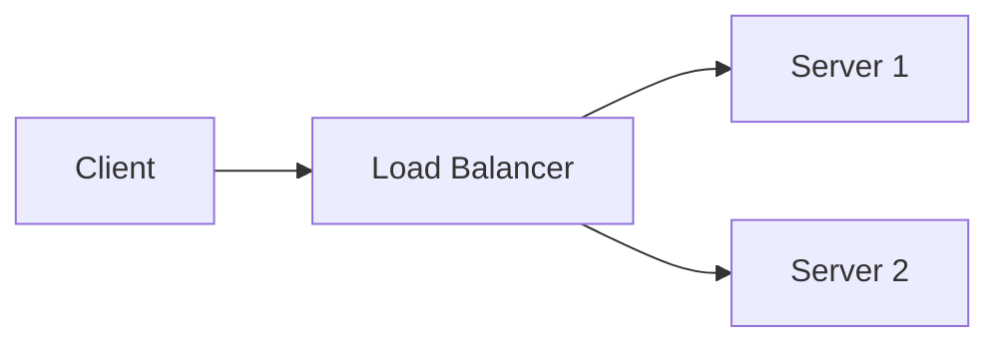
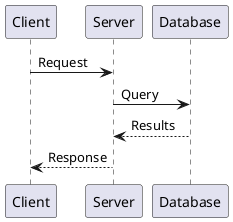

# Technical Diagrams and Visuals Guide

Best practices for using diagrams, screenshots, and visual elements in technical documentation.

---

## When to Use Visuals

### Diagrams Are Best For

- System architecture and component relationships
- Data flows and processes
- State machines and workflows
- Network topology
- Class/object relationships
- Sequence of interactions
- Decision trees

### Screenshots Are Best For

- UI walkthroughs
- Configuration steps
- Error messages
- Expected results
- Before/after comparisons

### Avoid Visuals When

- Text can explain it simply
- The visual will quickly become outdated
- The audience prefers text (developers reading code)
- Accessibility is a major concern

---

## Diagram Types

### Architecture Diagrams

**Purpose**: Show system components and their relationships

**Best Practices**:
- Use consistent shapes for component types
- Show clear directional arrows for data flow
- Group related components
- Label all connections
- Include a legend

**Example Structure**:
```
[Client] --HTTP--> [Load Balancer] --HTTP--> [Web Servers]
                                                  |
                                                  v
                                            [API Servers] --TCP--> [Database]
                                                  |
                                                  v
                                            [Cache Layer]
```

### Sequence Diagrams

**Purpose**: Show interactions between components over time

**Best Practices**:
- Keep participants to 5-7 maximum
- Number steps if order matters
- Show both requests and responses
- Use activation bars to show processing
- Note important timing or conditions

**When to Use**:
- API call flows
- Authentication sequences
- Multi-step processes
- Error handling flows

### Flowcharts

**Purpose**: Show decision logic and process flow

**Best Practices**:
- Start with a clear beginning
- Use standard shapes (rectangles for process, diamonds for decisions)
- Label all paths from decisions (Yes/No, True/False)
- End with clear termination points
- Keep it to one page

**Standard Shapes**:
- Rectangle: Process/action step
- Diamond: Decision point
- Oval: Start/End
- Parallelogram: Input/Output
- Arrow: Flow direction

### Entity Relationship Diagrams (ERD)

**Purpose**: Show database structure

**Best Practices**:
- Use standard notation (crow's foot, Chen, etc.)
- Show cardinality clearly (1:1, 1:N, M:N)
- Include primary/foreign keys
- Group related tables
- Use consistent naming

---

## Screenshot Guidelines

### Capture Best Practices

**Before Capturing**:
- Use default or neutral themes
- Clear test data (use realistic but fake data)
- Resize window to reasonable size
- Hide personal information
- Close unnecessary tabs/panels

**Capture Settings**:
- Consistent resolution (retina 2x recommended)
- PNG for UI, JPEG for photos
- Include relevant context, crop the rest
- Standard aspect ratios when possible

### Annotations

**Effective Callouts**:
- Use numbered callouts for multiple items
- Red for emphasis (sparingly)
- Arrows pointing to specific elements
- Consistent style throughout docs

**Annotation Types**:
1. **Highlight box**: Draw attention to an area
2. **Arrow**: Point to specific element
3. **Numbered callout**: Reference in text
4. **Text overlay**: Brief label on image
5. **Blur/redact**: Hide sensitive info

### File Naming

Use consistent, descriptive names:
```
feature-name-action-step.png

Examples:
settings-panel-overview.png
user-create-form-filled.png
error-message-validation.png
dashboard-widgets-expanded.png
```

### Alt Text

Write meaningful alt text:

**Good Alt Text**:
- "Settings panel showing notification options with Email Alerts toggle enabled"
- "Error dialog displaying 'Invalid email format' message with retry button"

**Bad Alt Text**:
- "Screenshot"
- "Image of settings"
- "Figure 1"

---

## Diagram Tools

### Text-Based (Diagrams as Code)

**Mermaid** (GitHub, GitLab, many platforms)


**PlantUML** (Many integrations)


**ASCII Art** (Universal compatibility)
```
+--------+     +--------+     +--------+
| Client | --> | Server | --> |   DB   |
+--------+     +--------+     +--------+
```

### Visual Tools

| Tool | Best For | Output |
|------|----------|--------|
| Lucidchart | Architecture, flowcharts | PNG, SVG |
| draw.io | General purpose, free | PNG, SVG |
| Excalidraw | Hand-drawn style | PNG, SVG |
| Figma | UI mockups | PNG, SVG |
| OmniGraffle | Mac users | PNG, PDF |

---

## Visual Style Guide

### Colors

**Standard Meanings**:
- Green: Success, approved, start
- Red: Error, danger, stop
- Yellow/Orange: Warning, caution
- Blue: Information, neutral
- Gray: Inactive, disabled

**Accessibility**:
- Don't rely on color alone
- Minimum contrast ratio 4.5:1
- Use patterns or labels with colors
- Test with color blindness simulators

### Typography in Diagrams

- Use sans-serif fonts (Arial, Helvetica)
- Minimum 10pt for readability
- Bold for emphasis, not ALL CAPS
- Consistent capitalization

### Consistency

Maintain across all diagrams:
- Same colors for same concepts
- Consistent shape meanings
- Uniform arrow styles
- Matching fonts and sizes
- Similar level of detail

---

## Embedding Visuals in Documentation

### Markdown

```markdown


<!-- With caption -->

*Figure 1: Diagram caption text*

<!-- With sizing (platform dependent) -->

```

### Best Practices

1. **Place visuals near related text**
2. **Reference in text**: "As shown in Figure 1..."
3. **Provide context**: Explain what to look for
4. **Caption complex visuals**: Add figure numbers and descriptions
5. **Link to full-size**: For detailed diagrams

---

## Keeping Visuals Updated

### Maintenance Strategy

1. **Track visual sources**: Store editable source files
2. **Version alongside docs**: Update when features change
3. **Regular audits**: Review visuals quarterly
4. **Automate when possible**: Use diagram-as-code
5. **Date screenshots**: Note the version captured

### When to Update

- UI changes significantly
- Feature functionality changes
- Diagram shows outdated architecture
- New components added
- Feedback indicates confusion

---

## Accessibility Checklist

- [ ] All images have alt text
- [ ] Alt text describes content meaningfully
- [ ] Color is not the only way to convey information
- [ ] Text in images meets contrast requirements
- [ ] Complex diagrams have text descriptions
- [ ] Animated content can be paused
- [ ] Flashing content is avoided

---

## Quick Reference

### Screenshot Checklist

- [ ] Relevant content visible
- [ ] Test/fake data used
- [ ] Personal info hidden
- [ ] Consistent resolution
- [ ] Properly cropped
- [ ] Descriptive filename
- [ ] Alt text written
- [ ] Referenced in text

### Diagram Checklist

- [ ] Clear purpose
- [ ] Appropriate diagram type
- [ ] All elements labeled
- [ ] Legend included (if needed)
- [ ] Consistent styling
- [ ] Readable at intended size
- [ ] Source file saved
- [ ] Alt text provided
